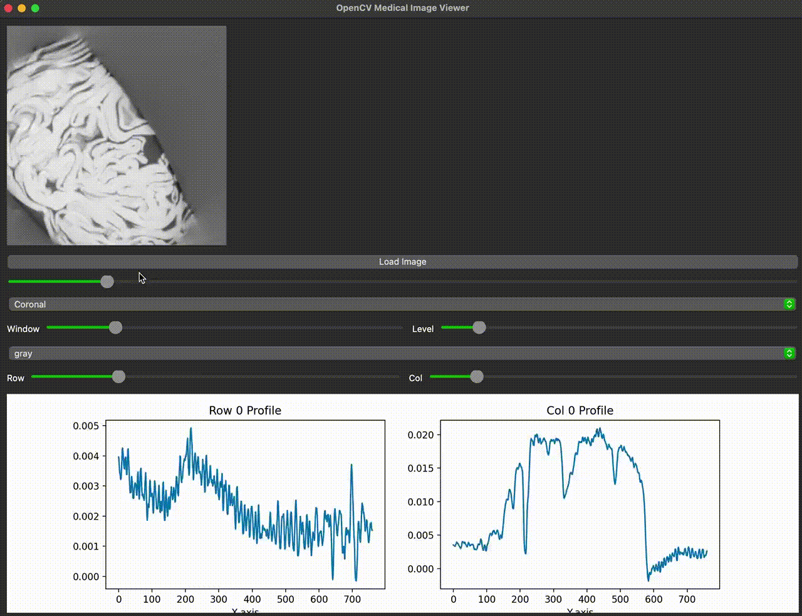

This is a small library that I'm using to conveniently view and plot profiles of medical images. Still working on it. 
Here's how you'd run it on terminal: python viewer.py
Then use the interactive windows to load and view image files. 
For now, there's only option to use sliders to go through slices, plot row/column profiles, adjust windows and levels.

Come back later for further updates. Thanks!

